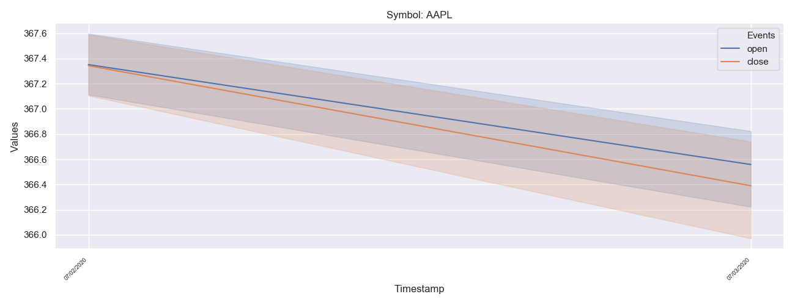

# RapidAPI Python Recquest example
This is a RapidAPI  Python example using request method which is similar to RapidAPI example found on [Rapidapi blog](https://rapidapi.com/blog/yahoo-finance-api-python/
) with one exception , this example uses request instead of 
unirest package
 
``I think this example will help you build python apps using API``

